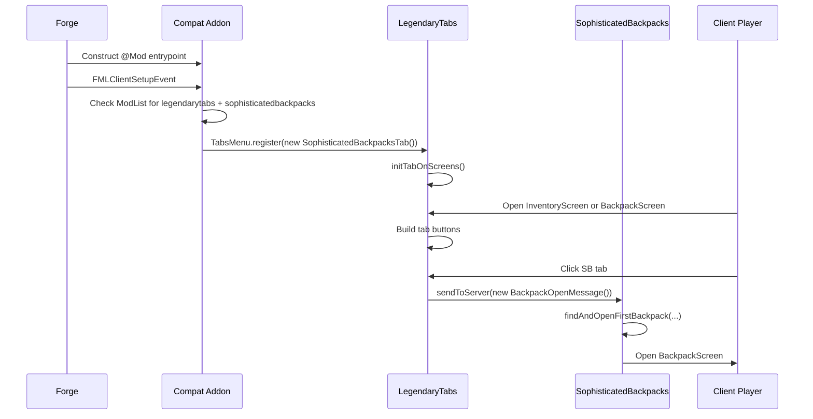

# Forge 1.20.1 Integration Report for a LegendaryTabs Tab for Sophisticated Backpacks

## Executive Summary

The cleanest implementation is **not** to create a second vanilla creative-inventory tab. entity["software","Sophisticated Backpacks","Forge backpack and storage mod for Minecraft 1.20.1"] already registers its own `CreativeModeTab` named `"main"` with the title key `itemGroup.sophisticatedbackpacks`, while entity["software","LegendaryTabs","Forge client GUI navigation tabs mod for Minecraft 1.20.1"] exposes a separate GUI-tab API built around `TabBase` and `TabsMenu.register(...)`. So the right architecture is a **small client-focused compat addon** that registers a new `LegendaryTabs` screen-navigation tab which opens the first accessible Sophisticated Backpack via `SBPPacketHandler.INSTANCE.sendToServer(new BackpackOpenMessage())`. That preserves SophisticatedBackpacks’ existing creative tab and adds the missing top-of-screen navigation tab users actually want. citeturn32view0turn32view2turn9view0turn11view0turn12view0turn47view1turn47view2

A rigorous implementation should treat the addon as **optional-interop glue**, not as a fork of either upstream mod. In practice that means isolating all optional references to LegendaryTabs and SophisticatedBackpacks inside client-only compat classes, gating registration behind `ModList.get().isLoaded(...)`, and avoiding static references to optional classes from always-loaded classes. That pattern matches the way both upstream mods already handle optional integrations and client setup. citeturn9view0turn47view0turn41search3

Primary materials reviewed were the urlLegendaryTabs repositoryturn0search0, the urlSophisticatedBackpacks repositoryturn0search1, and the urlForge 1.20.1 documentationturn39search1. Where a detail was not explicitly documented in those materials, it is marked as unspecified. citeturn39search1turn41search2

## Source-Based Architecture and Project Goals

The project goal should be stated narrowly: **add a dedicated LegendaryTabs navigation tab for SophisticatedBackpacks screens on Forge 1.20.1**, without duplicating SophisticatedBackpacks’ creative inventory tab, forking either upstream project, or introducing mixins unless a public hook proves insufficient. LegendaryTabs’ public API is explicit: it exposes `TabBase`, `TabsMenu.register(...)`, per-screen registration through `TabsMenu.addTabToScreen(...)`, and tab buttons rendered at `26x22` with hover/disabled state behavior handled by `TabButton`. citeturn11view0turn12view0turn12view1turn12view2

SophisticatedBackpacks already has two core pieces you need. First, it already defines a creative tab through its own `DeferredRegister<CreativeModeTab>` and registers backpack items such as leather, copper, iron, gold, diamond, and netherite backpacks there. Second, it already exposes the client/server opening workflow you want: `BackpackOpenMessage` without arguments finds and opens the first accessible backpack using `PlayerInventoryProvider.get().runOnBackpacks(...)`, and `BackpackScreen` is the screen class that represents the backpack UI. citeturn31view1turn31view3turn32view0turn32view2turn26view0turn47view2turn48view0

That leads to a straightforward architectural decision:

| Approach | Mechanism | Fit for this project | Verdict |
|---|---|---|---|
| **LegendaryTabs API** | Implement `TabBase`, call `TabsMenu.register(...)`, attach to `InventoryScreen` and optionally `BackpackScreen` | Matches the actual UI problem: cross-screen navigation tabs. Uses public hooks already exposed by LegendaryTabs. citeturn11view0turn12view0turn11view2turn11view3 | **Recommended** |
| **Vanilla `CreativeModeTab`** | Register or modify a creative inventory category | Wrong problem domain for screen navigation, and SophisticatedBackpacks already has a creative tab. citeturn32view0turn32view2turn39search2 | **Do not use as the primary solution** |
| **Hybrid** | Keep existing SophisticatedBackpacks creative tab, add a LegendaryTabs navigation tab through a compat addon | Preserves upstream behavior and adds only the missing UI affordance. citeturn32view0turn32view2turn9view0turn11view0 | **Best overall design** |

The only genuinely tricky part is **screen sizing** on the SophisticatedBackpacks screen. `StorageScreenBase` computes `imageWidth` and `imageHeight` dynamically from slot rows, columns taken by upgrades, total storage slots, and the current GUI-scaled window height. That means your LegendaryTabs sizing helper must mirror the same math if you want correct positioning on `BackpackScreen`, especially for tall backpacks that scroll. citeturn54view3turn53view0turn53view2turn54view0turn54view1

## Environment and Repository Baseline

For Forge 1.20.1, the baseline environment is **JDK 17**. Forge’s official 1.20.1 docs explicitly call for a Java 17 JDK and recommend using the MDK as the starting point. As of May 2026, the official Forge downloads page lists **47.4.20** as the latest 1.20.1 build and **47.4.10** as the recommended 1.20.1 build. citeturn39search1turn45search1

The upstream repos are not pinned to the same Forge patch level. LegendaryTabs’ 1.20.1 branch uses Minecraft `1.20.1`, Forge `47.3.22`, and a Gradle 8.8 wrapper. SophisticatedBackpacks’ 1.20.x branch targets Minecraft `1.20.1`, Forge artifact version `47.1.5` through NeoGradle, and a Gradle 8.1.1 wrapper. That version skew is not automatically fatal, but it means you should test against the **exact binary set you ship**, rather than assuming every 47.x combination behaves identically. citeturn5view1turn46view0turn21view0turn21view1turn46view1

A sensible development recommendation is:

| Component | Recommended baseline | Why |
|---|---|---|
| JDK | 17 | Required by Forge 1.20.1 docs. citeturn39search1 |
| Forge MDK | 47.4.20 for new work; 47.4.10 if you prefer the official “recommended” lane | Official 1.20.1 downloads page. citeturn45search1 |
| Gradle | Use the wrapper shipped with your chosen project template; do not rely on system Gradle | Forge docs recommend working from the MDK/workspace files, and upstream wrappers already pin exact versions. citeturn39search1turn46view0turn46view1 |
| Mappings | Whatever the MDK pins, unless you intentionally standardize on a shared mapping set | Avoid pointless mapping drift during interop work. citeturn39search1turn21view1 |

A practical repository layout for the addon should mirror the separation already visible in both upstream projects: mod entrypoint, client bootstrap, compat-only code, resources, and optional helper utilities. LegendaryTabs keeps its API in `api/tabs_menu`, client tab implementations in `client/tabs_menu`, and config in `config`; SophisticatedBackpacks splits its code among `client/gui`, `network`, `util`, and `init`. Your addon should copy that pattern instead of becoming a single giant compat class. citeturn11view0turn12view0turn22view0turn30view1turn47view1turn48view0

```text
legendarytabs-sb-compat/
├─ build.gradle
├─ settings.gradle
├─ gradle.properties
├─ src/main/java/dev/yourname/sbltcompat/
│  ├─ SbLtCompat.java
│  ├─ client/
│  │  ├─ ClientBootstrap.java
│  │  └─ compat/
│  │     └─ legendarytabs/
│  │        ├─ LegendaryTabsCompat.java
│  │        ├─ SophisticatedBackpacksTab.java
│  │        ├─ SophisticatedBackpacksSizing.java
│  │        └─ SophisticatedBackpacksLocator.java
│  └─ util/
│     └─ LogKeys.java
└─ src/main/resources/
   ├─ META-INF/mods.toml
   ├─ pack.mcmeta
   └─ assets/sbltcompat/
      ├─ lang/en_us.json
      └─ textures/gui/sophisticatedbackpacks_tab.png
```

```mermaid
flowchart LR
    A[Mod entrypoint] --> B[Client bootstrap]
    B --> C{legendarytabs loaded?}
    C -->|no| Z[Do nothing]
    C -->|yes| D{सophisticatedbackpacks loaded?}
    D -->|no| Z
    D -->|yes| E[LegendaryTabsCompat.register()]
    E --> F[TabsMenu.register new SophisticatedBackpacksTab]
    F --> G[InventoryScreen binding]
    F --> H[BackpackScreen binding]
    H --> I[Sizing helper mirrors StorageScreenBase]
```

This separation is not just style; it is what keeps optional dependency classloading from blowing up on startup. Forge lifecycle events are also parallel in many cases, so any cross-mod work that depends on stable registries or client state should be deferred with `enqueueWork(...)` inside the client setup event. citeturn41search3turn9view0

## Dependency Management and Implementation Design

Forge’s docs recommend `DeferredRegister` or `RegisterEvent` for registries, and `mods.toml` plus the `@Mod` entrypoint for mod metadata and loading. But the central design point here is that your addon should **not** register its own `CreativeModeTab` unless you intentionally want extra creative inventory UX. The actual registration work is just client startup plus a `TabBase` subclass. citeturn39search2turn41search2turn38search3

Because the reviewed sources did not expose a clean, public Maven coordinate for LegendaryTabs, the **highest-confidence dependency strategy** is either a **composite build** or a **local Maven/local repo publish** workflow during development. SophisticatedBackpacks’ build script clearly publishes artifact `sophisticatedbackpacks` under group `net.p3pp3rf1y`, and LegendaryTabs’ build script publishes a `legendarytabs` artifact under group `sfiomn.legendarytabs` into a local repo named `mcmodsrepo`. Exact externally consumable publication endpoints for LegendaryTabs were not specified in the reviewed materials. citeturn21view1turn5view0

### Recommended Gradle strategy

Use a Forge MDK-style addon project and either:

- include local clones as composite builds, or
- publish upstream mods to a local Maven repository and consume them with `fg.deobf(...)`.

A clean **source-driven** setup looks like this:

```gradle
plugins {
    id 'eclipse'
    id 'idea'
    id 'maven-publish'
    id 'net.minecraftforge.gradle' version '[6.0.24,6.2)'
}

group = 'dev.joshua.mods'
version = '1.20.1-0.1.0'
archivesBaseName = 'legendarytabs-sophisticatedbackpacks-compat'

java {
    toolchain {
        languageVersion = JavaLanguageVersion.of(17)
    }
}

minecraft {
    mappings channel: 'official', version: '1.20.1'
    copyIdeResources = true

    runs {
        configureEach {
            workingDirectory project.file("run/${it.name}")
            property 'forge.logging.console.level', 'debug'
            mods {
                sbltcompat {
                    source sourceSets.main
                }
            }
        }

        client {}
        server {}
    }
}

repositories {
    maven { url = 'https://maven.minecraftforge.net' }
    mavenLocal()
}

dependencies {
    minecraft 'net.minecraftforge:forge:1.20.1-47.4.20'

    // Prefer composite builds or locally-published artifacts for upstream mods.
    // Versions below match the branch metadata reviewed in the source repos.
    compileOnly fg.deobf('sfiomn.legendarytabs:legendarytabs:1.20.1-1.1.3.1')
    runtimeOnly fg.deobf('sfiomn.legendarytabs:legendarytabs:1.20.1-1.1.3.1')

    compileOnly fg.deobf('net.p3pp3rf1y:sophisticatedbackpacks:1.20.1-3.24.38.1')
    runtimeOnly fg.deobf('net.p3pp3rf1y:sophisticatedbackpacks:1.20.1-3.24.38.1')
}
```

If you are co-developing against source checkouts, a `settings.gradle` composite-build setup is usually the least painful route:

```gradle
pluginManagement {
    repositories {
        gradlePluginPortal()
        maven { url = 'https://maven.minecraftforge.net/' }
    }
}

plugins {
    id 'org.gradle.toolchains.foojay-resolver-convention' version '0.7.0'
}

// Adjust paths for your workspace.
includeBuild('../LegendaryTabs')
includeBuild('../SophisticatedBackpacks')
```

### Core Java design

The essential design is four classes:

| Class | Responsibility |
|---|---|
| `SbLtCompat` | Minimal `@Mod` entrypoint |
| `ClientBootstrap` | Client setup listener and load checks |
| `LegendaryTabsCompat` | Optional-dependency bridge that calls `TabsMenu.register(...)` |
| `SophisticatedBackpacksTab` | `TabBase` implementation |
| `SophisticatedBackpacksLocator` | Finds the first accessible backpack via `PlayerInventoryProvider` |
| `SophisticatedBackpacksSizing` | Mirrors `StorageScreenBase` width/height calculations |

That split is justified directly by upstream code: LegendaryTabs wants a `TabBase` registered on client setup, while SophisticatedBackpacks already publishes the exact public pieces you need to locate backpacks, open them, and identify its screen class. citeturn9view0turn11view0turn12view0turn26view0turn47view2turn48view0

### Example mod entrypoint

```java
package dev.joshua.mods.sbltcompat;

import net.minecraftforge.api.distmarker.Dist;
import net.minecraftforge.eventbus.api.IEventBus;
import net.minecraftforge.fml.loading.FMLEnvironment;
import net.minecraftforge.fml.common.Mod;
import net.minecraftforge.fml.javafmlmod.FMLJavaModLoadingContext;
import dev.joshua.mods.sbltcompat.client.ClientBootstrap;

@Mod(SbLtCompat.MOD_ID)
public final class SbLtCompat {
    public static final String MOD_ID = "sbltcompat";

    public SbLtCompat() {
        IEventBus modBus = FMLJavaModLoadingContext.get().getModEventBus();
        if (FMLEnvironment.dist == Dist.CLIENT) {
            modBus.addListener(ClientBootstrap::onClientSetup);
        }
    }
}
```

### Example client bootstrap

```java
package dev.joshua.mods.sbltcompat.client;

import net.minecraftforge.fml.ModList;
import net.minecraftforge.fml.event.lifecycle.FMLClientSetupEvent;
import dev.joshua.mods.sbltcompat.client.compat.legendarytabs.LegendaryTabsCompat;

public final class ClientBootstrap {
    private ClientBootstrap() {}

    public static void onClientSetup(final FMLClientSetupEvent event) {
        boolean hasLegendaryTabs = ModList.get().isLoaded("legendarytabs");
        boolean hasSophisticatedBackpacks = ModList.get().isLoaded("sophisticatedbackpacks");

        if (!hasLegendaryTabs || !hasSophisticatedBackpacks) {
            return;
        }

        event.enqueueWork(LegendaryTabsCompat::register);
    }
}
```

### Example LegendaryTabs bridge

```java
package dev.joshua.mods.sbltcompat.client.compat.legendarytabs;

import sfiomn.legendarytabs.api.tabs_menu.TabsMenu;

public final class LegendaryTabsCompat {
    private LegendaryTabsCompat() {}

    public static void register() {
        TabsMenu.register(new SophisticatedBackpacksTab());
    }
}
```

### Example backpack locator

```java
package dev.joshua.mods.sbltcompat.client.compat.legendarytabs;

import java.util.Optional;
import java.util.concurrent.atomic.AtomicReference;

import net.minecraft.world.entity.player.Player;
import net.p3pp3rf1y.sophisticatedbackpacks.api.CapabilityBackpackWrapper;
import net.p3pp3rf1y.sophisticatedbackpacks.backpack.wrapper.IBackpackWrapper;
import net.p3pp3rf1y.sophisticatedbackpacks.util.PlayerInventoryProvider;

public final class SophisticatedBackpacksLocator {
    private SophisticatedBackpacksLocator() {}

    public static Optional<IBackpackWrapper> findFirstBackpack(Player player) {
        AtomicReference<IBackpackWrapper> result = new AtomicReference<>();

        PlayerInventoryProvider.get().runOnBackpacks(player, (stack, handlerName, identifier, slot) -> {
            stack.getCapability(CapabilityBackpackWrapper.BACKPACK_WRAPPER_CAPABILITY)
                    .ifPresent(result::set);
            return result.get() != null;
        });

        return Optional.ofNullable(result.get());
    }

    public static boolean hasOpenableBackpack(Player player) {
        return findFirstBackpack(player).isPresent();
    }
}
```

### Example dynamic sizing helper

This mirrors the actual `StorageScreenBase` logic: base height `114`, slot size `18`, width determined by whether storage fits the “9 slot line” or “12 slot line” mode, and an extra `+6` width when the screen must scroll. That is the crucial detail that makes the `BackpackScreen` tab line up correctly. citeturn54view3turn53view0turn53view2turn54view0turn54view1

```java
package dev.joshua.mods.sbltcompat.client.compat.legendarytabs;

import net.minecraft.client.Minecraft;
import net.minecraft.world.entity.player.Player;
import net.p3pp3rf1y.sophisticatedbackpacks.backpack.wrapper.IBackpackWrapper;

public final class SophisticatedBackpacksSizing {
    private static final int HEIGHT_WITHOUT_STORAGE_SLOTS = 114;
    private static final int SLOT_SIZE = 18;
    private static final int BASE_WIDTH_PADDING = 14;
    private static final int SCROLLBAR_WIDTH_DELTA = 6;

    private SophisticatedBackpacksSizing() {}

    public static int getWidth(Player player) {
        return SophisticatedBackpacksLocator.findFirstBackpack(player)
                .map(SophisticatedBackpacksSizing::computeWidth)
                .orElse(176);
    }

    public static int getHeight(Player player) {
        return SophisticatedBackpacksLocator.findFirstBackpack(player)
                .map(SophisticatedBackpacksSizing::computeHeight)
                .orElse(166);
    }

    private static int computeWidth(IBackpackWrapper wrapper) {
        int totalRows = Math.max(wrapper.getNumberOfSlotRows(), 0);
        int totalSlots = wrapper.getInventoryHandler().getSlots();
        int columnsTaken = Math.max(wrapper.getColumnsTaken(), 0);

        int slotsOnLine = (totalSlots + columnsTaken * totalRows) <= 81 ? 9 : 12;
        int width = slotsOnLine * SLOT_SIZE + BASE_WIDTH_PADDING;

        if (getDisplayableRows(totalRows) < totalRows) {
            width += SCROLLBAR_WIDTH_DELTA;
        }
        return width;
    }

    private static int computeHeight(IBackpackWrapper wrapper) {
        return HEIGHT_WITHOUT_STORAGE_SLOTS + getDisplayableRows(wrapper.getNumberOfSlotRows()) * SLOT_SIZE;
    }

    private static int getDisplayableRows(int totalRows) {
        Minecraft mc = Minecraft.getInstance();
        if (mc == null || mc.getWindow() == null) {
            return Math.max(totalRows, 0);
        }

        int rowsFromViewport = Math.max((mc.getWindow().getGuiScaledHeight() - HEIGHT_WITHOUT_STORAGE_SLOTS) / SLOT_SIZE, 0);
        return Math.min(rowsFromViewport, Math.max(totalRows, 0));
    }
}
```

### Example `TabBase` implementation

```java
package dev.joshua.mods.sbltcompat.client.compat.legendarytabs;

import dev.joshua.mods.sbltcompat.SbLtCompat;
import net.minecraft.client.gui.GuiGraphics;
import net.minecraft.client.gui.screens.Screen;
import net.minecraft.client.gui.screens.inventory.InventoryScreen;
import net.minecraft.network.chat.Component;
import net.minecraft.resources.ResourceLocation;
import net.minecraft.world.entity.player.Player;
import net.p3pp3rf1y.sophisticatedbackpacks.client.gui.BackpackScreen;
import net.p3pp3rf1y.sophisticatedbackpacks.network.BackpackOpenMessage;
import net.p3pp3rf1y.sophisticatedbackpacks.network.SBPPacketHandler;
import sfiomn.legendarytabs.api.tabs_menu.TabBase;
import sfiomn.legendarytabs.api.tabs_menu.TabsMenu;

public final class SophisticatedBackpacksTab extends TabBase {
    private static final ResourceLocation TEXTURE =
            new ResourceLocation(SbLtCompat.MOD_ID, "textures/gui/sophisticatedbackpacks_tab.png");

    @Override
    public void openTargetScreen(Player player) {
        SBPPacketHandler.INSTANCE.sendToServer(new BackpackOpenMessage());
    }

    @Override
    public boolean isEnabled(Player player) {
        return SophisticatedBackpacksLocator.hasOpenableBackpack(player);
    }

    @Override
    public void initTabOnScreens() {
        TabsMenu.addTabToScreen(this, InventoryScreen.class, p -> 176, p -> 166, 25);

        // Use dynamic sizing for the SophisticatedBackpacks UI itself.
        TabsMenu.addTabToScreen(this, BackpackScreen.class,
                SophisticatedBackpacksSizing::getWidth,
                SophisticatedBackpacksSizing::getHeight,
                25);
    }

    @Override
    public void render(GuiGraphics gui, int x, int y, boolean hover) {
        int u = hover ? 26 : 0;
        gui.blit(TEXTURE, x, y, u, 0, TAB_WIDTH, TAB_HEIGHT, 52, 22);
    }

    @Override
    public boolean isCurrentlyUsed(Screen currentScreen) {
        return currentScreen instanceof BackpackScreen;
    }

    @Override
    public Component getTooltip() {
        return Component.translatable("tooltip.sbltcompat.tab.sophisticatedbackpacks");
    }
}
```

### Registration flow



The important implementation conclusion is brutal and simple: **use LegendaryTabs for navigation, leave SophisticatedBackpacks’ creative tab alone, and reuse SophisticatedBackpacks’ own packet and inventory-provider logic instead of inventing your own backpack-opening pipeline.** That is the shortest path with the lowest maintenance surface. citeturn32view0turn32view2turn47view2turn48view0

## Assets, Resource Files, and User-Facing UX

Your resource footprint is tiny. You need `mods.toml`, `pack.mcmeta`, `en_us.json`, and at least one GUI texture for the tab button. Icon art itself is **unspecified** in the source materials, so the report cannot prescribe a final visual design beyond technical constraints. Forge expects `mods.toml` under `src/main/resources/META-INF`, and `pack.mcmeta` in the resource root. citeturn41search2turn15view2

A good working `mods.toml` for a **client-focused compat addon** is:

```toml
modLoader="javafml"
loaderVersion="[47,)"
license="MIT"
issueTrackerURL="https://github.com/yourname/legendarytabs-sophisticatedbackpacks-compat/issues"

[[mods]]
modId="sbltcompat"
version="${file.jarVersion}"
displayName="LegendaryTabs Sophisticated Backpacks Compat"
authors="Joshua"
description='''
Adds a dedicated LegendaryTabs navigation tab for Sophisticated Backpacks on Forge 1.20.1.
'''
displayTest="IGNORE_SERVER_VERSION"

[[dependencies.sbltcompat]]
modId="forge"
mandatory=true
versionRange="[47,)"
ordering="NONE"
side="BOTH"

[[dependencies.sbltcompat]]
modId="minecraft"
mandatory=true
versionRange="[1.20.1,1.21)"
ordering="NONE"
side="BOTH"

[[dependencies.sbltcompat]]
modId="legendarytabs"
mandatory=true
versionRange="[1.20.1-1.1.3.1,)"
ordering="AFTER"
side="CLIENT"

[[dependencies.sbltcompat]]
modId="sophisticatedbackpacks"
mandatory=true
versionRange="[1.20.1-3.24.38,)"
ordering="AFTER"
side="CLIENT"
```

That design is grounded in Forge’s `mods.toml` rules and the fact that your addon is UI glue rather than server gameplay logic. If you later decide to ship it on both sides, switch those optional-client dependencies accordingly. citeturn41search2turn39search0

Your language file can stay almost laughably small:

```json
{
  "tooltip.sbltcompat.tab.sophisticatedbackpacks": "Open Sophisticated Backpacks",
  "itemGroup.sbltcompat": "LegendaryTabs SB Compat"
}
```

And your `pack.mcmeta` can remain standard for 1.20.1 resources:

```json
{
  "pack": {
    "description": "LegendaryTabs Sophisticated Backpacks Compat resources",
    "pack_format": 15
  }
}
```

For the icon texture, the practical recommendation is a **52×22** or **54×22** GUI PNG containing normal and hover/selected states side by side, then blit either the left or right half. Unlike items and blocks, this texture does **not** need atlas stitching if you access it directly with `GuiGraphics.blit(...)` as a GUI texture. The atlas becomes relevant only if you add actual item/block assets or model-based icons. LegendaryTabs’ own button rendering pattern supports this style cleanly because `TabBase.render(...)` is entirely mod-defined. citeturn12view0turn12view1turn11view2turn11view3

Reference visuals for the target UX:

image_group{"layout":"carousel","aspect_ratio":"16:9","query":["Sophisticated Backpacks Minecraft backpack GUI screenshot", "Minecraft inventory screen mod tabs screenshot Forge", "Minecraft creative inventory tab screenshot 1.20.1"],"num_per_query":1}

The design call here is straightforward: use a **backpack silhouette with Sophisticated-style color blocking**, keep it legible at 26×22, and do not try to be clever with a photorealistic micro-icon because that will look like smeared soup at GUI scale. Icon art is unspecified by the sources, but the rendering constraints absolutely are not. citeturn12view0turn12view1

## Compatibility, Build, and Publishing Guidance

From an interop standpoint, the biggest trap is **optional dependency classloading**. Both upstream mods already show the correct pattern: check `ModList.get().isLoaded(...)`, instantiate compat code only when the target mod exists, and keep optional integrations out of unconditional startup paths. If you import `BackpackScreen`, `TabsMenu`, or `TabBase` in a class that Forge loads on both sides or before dependency checks, you are writing a bug report in advance. citeturn9view0turn47view0turn41search3

The addon described in this report should **not need mixins or access transformers**. The hooks you need are already public:

- `TabBase` and `TabsMenu.register(...)` in LegendaryTabs. citeturn11view0turn12view0
- `BackpackOpenMessage`, `SBPPacketHandler`, `BackpackScreen`, and `PlayerInventoryProvider` in SophisticatedBackpacks. citeturn26view0turn47view1turn47view2turn48view0
- Forge lifecycle and mod metadata mechanisms in official docs. citeturn41search2turn41search3turn39search2

For versioning, use a format that makes it impossible to confuse Minecraft compatibility with addon revision. A sane pattern is:

| Field | Recommendation |
|---|---|
| Maven group | `dev.joshua.mods` or your actual namespace |
| Artifact | `legendarytabs-sophisticatedbackpacks-compat` |
| Mod version | `1.20.1-0.1.0` |
| Release tags | `mc1.20.1/v0.1.0` or `1.20.1-0.1.0` |
| Dependency policy | Pin to the exact LegendaryTabs and SophisticatedBackpacks versions you test against |

If you publish to a Maven repository, export normal Maven coordinates and keep CurseForge/Modrinth packaging as a separate release concern. If you do **not** yet have a reliable public Maven for LegendaryTabs, use `publishToMavenLocal` or a workspace-local Maven folder in CI. The reviewed LegendaryTabs sources indicate a local Maven-style publishing flow rather than a clearly documented public package endpoint. citeturn5view0

If you later choose to upstream the work, the most valuable possible upstream improvement would be a **small LegendaryTabs API enhancement** allowing screen-dimension suppliers to depend on the actual screen instance, not only the player. Your current addon can still mirror SophisticatedCore’s math using `Minecraft.getInstance().getWindow().getGuiScaledHeight()`, but a screen-aware API would make this kind of integration less brittle. That is an engineering recommendation, not a documented requirement. It follows from the dynamic sizing logic visible in `StorageScreenBase`. citeturn54view3turn53view0turn53view2

## Testing, Debugging, and Delivery Plan

Testing should be split into **pure helper tests**, **client integration tests**, and **manual in-game verification**. Because the mod is mostly UI glue, automated tests are most useful for dimension math and backpack-detection helpers; the real failure modes are dependency loading, missing tab registration, bad resource paths, and incorrect screen alignment. Those risks are visible directly in the upstream APIs and sizing logic you are depending on. citeturn11view0turn12view1turn47view2turn48view0turn54view3

### Recommended test matrix

| Test class | What to verify | Expected outcome |
|---|---|---|
| Unit test: `SophisticatedBackpacksSizing` | Width/height math for 9-line vs 12-line layouts and scroll cases | Matches the `StorageScreenBase` formulas |
| Unit test: `SophisticatedBackpacksLocator` | Presence/absence of an accessible backpack | `isEnabled` only returns true when opening should succeed |
| Integration test: client startup with both mods | Tab registers without classloading errors | No crash, tab appears on inventory |
| Integration test: click tab from inventory | Packet opens the first backpack | Backpack screen opens |
| Integration test: click tab while already in `BackpackScreen` | Current-screen state disables or highlights correctly | No redundant reopen spam |
| Manual test: GUI scale sweep | Scales Small/Normal/Large/Auto | Tab placement remains aligned |
| Manual test: backpack tiers | leather, copper, iron, gold, diamond, netherite | Width/height logic remains stable |
| Manual test: inventory positions | main inventory, offhand, armor/chest slot, compat handlers if present | Locator finds and opens correctly |

### Debugging tips

If the tab does not appear at all, debug in this order. First, confirm both target mods are actually loaded and that your client setup listener runs. Second, set breakpoints on `LegendaryTabsCompat.register()`, `SophisticatedBackpacksTab.isEnabled(...)`, and `SophisticatedBackpacksTab.initTabOnScreens()`. Third, verify the translation key and texture path. Fourth, if the tab appears on inventory but not on backpack screens, treat the sizing helper as your prime suspect and compare its computed width/height with SophisticatedCore’s formulas. Fifth, if clicking the tab does nothing, inspect whether `BackpackOpenMessage` is being sent and whether `PlayerInventoryProvider.runOnBackpacks(...)` finds a stack. citeturn9view0turn11view0turn12view1turn47view2turn48view0turn54view3

### Step-by-step implementation plan

| Task | Description | Estimate |
|---|---|---:|
| Workspace setup | Create a fresh Forge 1.20.1 addon project, import MDK, pin Java 17 | 30–45 min |
| Dependency wiring | Add composite build or local Maven consumption for LegendaryTabs and SophisticatedBackpacks | 45–90 min |
| Bootstrap skeleton | Add `@Mod` entrypoint and client setup listener | 20–30 min |
| Optional-dependency isolation | Create compat package boundary and load checks | 30–45 min |
| Tab implementation | Implement `TabBase` subclass, tooltip, render, click-open behavior | 60–90 min |
| Backpack detection helper | Reuse `PlayerInventoryProvider` + capability lookup | 30–45 min |
| Dynamic sizing helper | Mirror `StorageScreenBase` width/height formulas | 60–90 min |
| Resources | Add lang file, `pack.mcmeta`, and tab texture | 45–120 min |
| In-game validation | Test inventory tab display, click behavior, backpack-screen alignment | 90–150 min |
| Packaging and metadata | Finalize `mods.toml`, version string, jar manifest, publish task | 30–60 min |
| Regression pass | Test against exact versions you intend to ship | 60–120 min |

A realistic first-pass total is **about one focused day** if you already know Forge, and **a day and a half** if you want the release polish to be clean instead of “technically runs, therefore apparently finished,” which is the sort of lie that causes modpacks to become haunted. citeturn39search1turn45search1

### Deliverables checklist

- [ ] Forge 1.20.1 addon project with Java 17 toolchain
- [ ] Optional client-only compat bootstrap
- [ ] `SophisticatedBackpacksTab extends TabBase`
- [ ] Backpack locator helper using `PlayerInventoryProvider`
- [ ] Dynamic sizing helper mirroring `StorageScreenBase`
- [ ] `mods.toml`
- [ ] `pack.mcmeta`
- [ ] `assets/.../lang/en_us.json`
- [ ] `assets/.../textures/gui/sophisticatedbackpacks_tab.png`
- [ ] Manual test notes for GUI scale and backpack tiers
- [ ] Release versioning and publish tasks
- [ ] README describing dependency expectations and tested versions

### Open questions and limitations

A few details remain genuinely unspecified in the reviewed sources, and they should be treated as such rather than hand-waved:

- **LegendaryTabs public Maven endpoint** was not clearly documented in the reviewed repository materials. A composite build or local Maven publication flow is the safest assumption.
- **Final icon art direction** is unspecified. Only the rendering constraints are clear.
- **Exact release dependency versions** should be pinned to the binaries you test with, because the upstream repos currently target different Forge 47.x patch levels.
- If you want the tab to appear on **every third-party inventory-like screen** that LegendaryTabs supports, you will need additional per-screen registration decisions beyond the core `InventoryScreen` and `BackpackScreen` binding covered here.